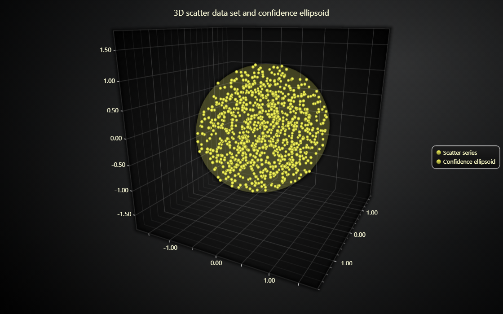

# JavaScript 3D Confidence Ellipsoid Chart



This demo application belongs to the set of examples for LightningChart JS, data visualization library for JavaScript.

LightningChart JS is entirely GPU accelerated and performance optimized charting library for presenting massive amounts of data. It offers an easy way of creating sophisticated and interactive charts and adding them to your website or web application.

The demo can be used as an example or a seed project. Local execution requires the following steps:

-   Make sure that relevant version of [Node.js](https://nodejs.org/en/download/) is installed
-   Open the project folder in a terminal:

          npm install              # fetches dependencies
          npm start                # builds an application and starts the development server

-   The application is available at _http://localhost:8080_ in your browser, webpack-dev-server provides hot reload functionality.


## Description

Example showcasing the 3D variant of a common statistical data visualization method: confidence ellipses.

Confidence ellipses are used especially with statistic chart applications. A common usage, for example, is the 95% confidence ellipse, which visualizes the area that contains 95% of samples, which makes it easier for the user to understand which points are _outliers_.

The same can be done in more complex 3D scatter data set visualizations, in which case the ellipse becomes an _ellipsoid_.

Programmatically, this can be implemented by drawing the ellipsoid as a _sphere_ with different sizes along the X, Y and Z axes.

```ts
const ellipsoidSeries = chart3D
    .addPointSeries()
    // Specify ellipsoid center coordinate.
    .add({ x: 0, y: 0, z: 0 })
    .setPointStyle(
        new PointStyle3D.Triangulated({
            // Specify ellipsoid dimensions.
            size: { x: 1, y: 2, z: 1.5 },
        }),
    )
```


## API Links

* [3D chart]
* [3D axis]
* [Point series 3D]


## Support

If you notice an error in the example code, please open an issue on [GitHub][0] repository of the entire example.

Official [API documentation][1] can be found on [LightningChart][2] website.

If the docs and other materials do not solve your problem as well as implementation help is needed, ask on [StackOverflow][3] (tagged lightningchart).

If you think you found a bug in the LightningChart JavaScript library, please contact sales@lightningchart.com.

Direct developer email support can be purchased through a [Support Plan][4] or by contacting sales@lightningchart.com.

[0]: https://github.com/Arction/
[1]: https://lightningchart.com/lightningchart-js-api-documentation/
[2]: https://lightningchart.com
[3]: https://stackoverflow.com/questions/tagged/lightningchart
[4]: https://lightningchart.com/support-services/

© LightningChart Ltd 2009-2025. All rights reserved.


[3D chart]: https://lightningchart.com/js-charts/api-documentation/v8.0.0/classes/Chart3D.html
[3D axis]: https://lightningchart.com/js-charts/api-documentation/v8.0.0/classes/Axis3D.html
[Point series 3D]: https://lightningchart.com/js-charts/api-documentation/v8.0.0/classes/PointSeries3D.html

